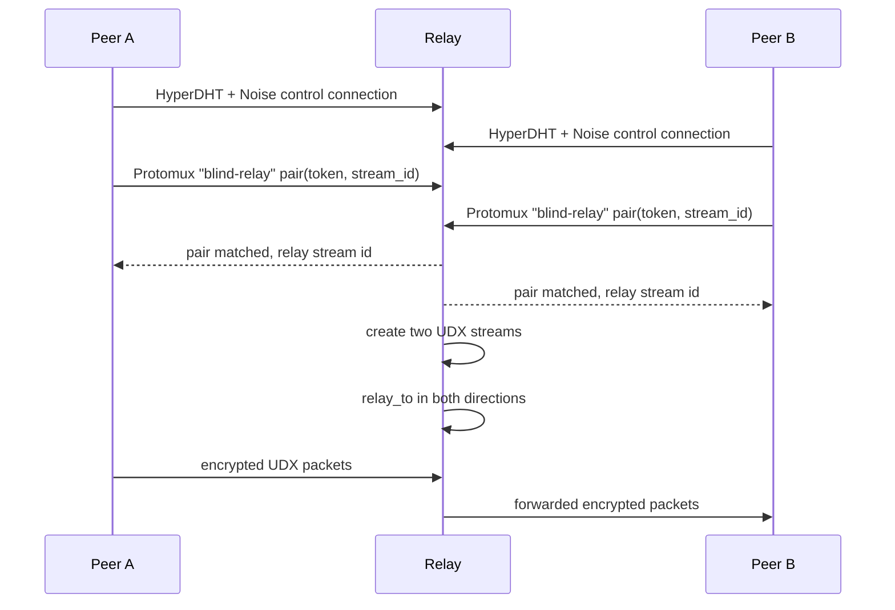

# Relay Architecture

This chapter describes how peeroxide's blind-relay implementation works internally.

At a high level, the relay has two separate jobs:

1. accept an authenticated control connection from each peer,
2. once both sides present the same relay token, create two raw UDX streams and bridge them.

The relay never terminates the application protocol spoken by the two real peers.

## Control plane vs. data plane

The control plane is a normal HyperDHT connection to the relay node. Each side completes the relay's own Noise/SecretStream session, then opens a Protomux channel named `"blind-relay"`.

The data plane is different. After the relay matches a token, it creates two UDX streams and wires them together with `UdxStream::relay_to` in both directions. Those forwarded packets belong to the real peer-to-peer session, not to the relay's control channel.

## The pairing model

The protocol engine lives in `peeroxide-dht/src/blind_relay.rs`.

- `BlindRelayServer` owns the shared pairing tables and limits for the whole relay instance.
- `BlindRelaySession` represents one accepted control connection.
- `BlindRelayClient` is the client-side helper used by a peer connecting through a relay.

Each `pair` message carries:

- a 32-byte token,
- an `is_initiator` bit,
- the sender's local UDX stream id.

The relay keeps up to two pending links per token: one initiator slot and one responder slot. When both are present, the token is considered matched and the relay emits a `MatchedPairing` record to the transport layer.

That transport layer lives in `peeroxide-dht/src/relay_service.rs`, which creates the actual streams, bridges them, and notifies both sessions of the relay-assigned stream ids to use.

`unpair` removes a pending token or tears down an already-active bridged pairing.

## Why the relay is “blind”

The important boundary is this:

- the relay's **control connections** are encrypted so each side can authenticate to the relay and exchange pair/unpair messages safely,
- the **relayed application payload** is already end-to-end encrypted between the two real peers.

So the relay is not providing payload confidentiality. It is forwarding ciphertext that was produced for the real peer-to-peer session.

In peeroxide's transport wiring, that forwarding happens at the UDX packet level through `relay_to`. The relay never unwraps the application's SecretStream frames and never learns the plaintext.

## Server-side swarm behavior

On the client side, blind relay is integrated into `peeroxide::Swarm`.

When a swarm is configured with `SwarmConfig::relay_through`, the server side changes its handshake reply:

- it mints a fresh relay token,
- it includes `relay_through` metadata naming the relay public key,
- it optionally includes `relay_addresses` when `SwarmConfig::relay_address` is known,
- it skips the normal holepunch path for that connection.

Later, once the server receives the inbound handshake, it calls `create_server_relay_connection` to:

1. connect to the relay over HyperDHT,
2. open a `BlindRelayClient` on the control channel,
3. pair with the token,
4. open the relayed UDX data stream,
5. wrap that data stream with the already-negotiated peer-to-peer SecretStream session.

That last step is why the relay does not become the endpoint of the application encryption.

## Session limits and timeouts

Peeroxide adds configurable operational limits around the Node-compatible relay protocol:

| Setting | Default | Effect |
|---|---:|---|
| `max_sessions` | `10000` | Maximum concurrent accepted relay sessions. |
| `max_pairings_per_session` | `256` | Caps how many pending + active tokens one session can hold. |
| `pairing_timeout` | `300s` | Drops a token if the matching side never arrives. |
| `idle_session_timeout` | `600s` | Closes a session with no pair/unpair activity. |

These live in `BlindRelayServerConfig`.

Node's reference `blind-relay` package does **not** have equivalents for those limits or timeouts. Peeroxide adds them as hardening measures with generous defaults so a default deployment still behaves much like the unthrottled reference implementation.

## Teardown behavior

Once a pairing is active, peeroxide tracks the bridged stream pair by token.

Two teardown paths matter:

1. **Unpair on an active token**: the relay stops forwarding and drops the bridged streams.
2. **Session close**: if either control session closes, every active pairing owned by that session is torn down.

This teardown behavior has direct precedent in Node's reference implementation: Node's `blind-relay` destroys active streams in its `_onunpair` and `_onclose` paths.

The idle-session sweep is different. That is a peeroxide-only addition with no Node precedent.

## Maintenance loops

`relay_service::run_relay_server` runs two background maintenance loops in addition to handshake acceptance:

- a periodic self-announce refresh loop for the relay's own identity,
- a periodic sweep loop that expires stale pending pairings and closes idle sessions.

The sweep loop is what enforces `pairing_timeout` and `idle_session_timeout` in practice.

## Self-announcement and discovery

One subtle but important implementation detail is that the relay must do more than call `register_server` locally.

`register_server` only teaches the local DHT router to handle inbound `PEER_HANDSHAKE` requests for `hash(public_key)` if they somehow arrive. It does **not** tell the rest of the network that this relay exists.

Peeroxide therefore self-announces the relay's own identity target, `hash(public_key)`, at startup and on a roughly 10-minute refresh loop. This mirrors Node's `Server.listen()` behavior.

That matters for interoperability. A Node.js `hyperdht` client connecting by relay public key does discovery through a lookup-style `findPeer` query for an announced record on `hash(public_key)`. Without the self-announce, the relay could be perfectly healthy locally but still undiscoverable remotely, producing `PEER_NOT_FOUND`.

## Why `relay_service` is separate from `Swarm`

A relay is not a topic participant. It does not join discovery topics, manage peer sets, or maintain swarm retry state.

For that reason, peeroxide keeps the relay transport wiring in `peeroxide-dht::relay_service` as a small accept-and-bridge service built directly on HyperDHT and UDX, while `peeroxide::Swarm` consumes the relay from the client side.

## See Also

- [Relay Overview](overview.md)
- [DHT and Routing](../concepts/dht-and-routing.md)
- [Security Model](../appendices/security-model.md)
